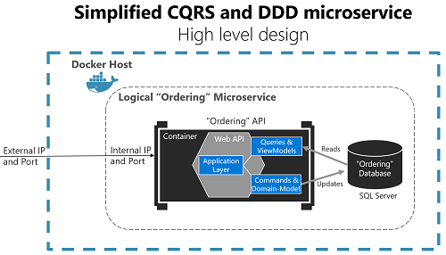
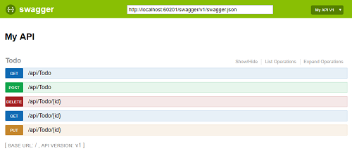
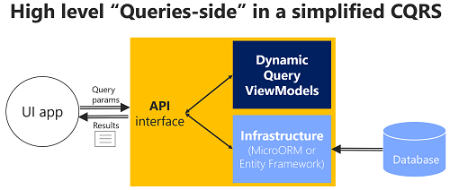
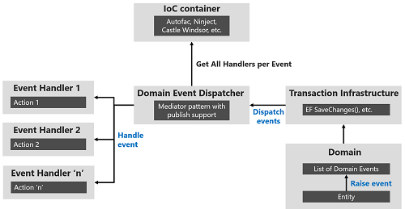
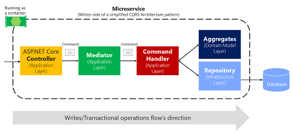
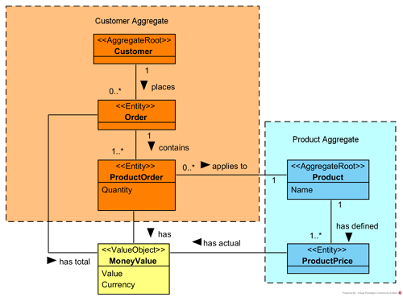
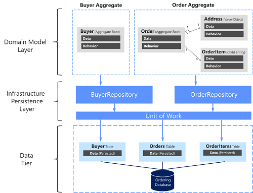

Ejemplo .NET Core REST API CQRS implementacion con SQL y DDD usando Clean Architecture.
==============================================================

## Description
Ejemplo .NET Core REST API implementado con [CQRS](https://docs.microsoft.com/es-es/azure/architecture/guide/architecture-styles/cqrs) and Domain Driven Design

## Architecture [Clean Architecture](http://blog.cleancoder.com/uncle-bob/2012/08/13/the-clean-architecture.html)

## API

### Swagger
* Swashbuckle.AspNetCore.Swagger
* Swashbuckle.AspNetCore.Gen
* Swashbuckle.AspNetCore.SwaggerUI

## CQRS

Read Model - Uso de Dapper como micro ORM para realizar consultas:
* [Dapper](https://github.com/StackExchange/Dapper)

Write Model - Domain Driven Design using:
* [Entity Framework Core](https://github.com/dotnet/efcore)

Commands/Queries/Domain Events handling using:
* [MediatR](https://github.com/jbogard/MediatR) library
* [Autofac](https://autofaccn.readthedocs.io/en/latest/integration/aspnetcore.html) library
* [FluentValidation](https://github.com/FluentValidation/FluentValidation) library 

## Domain

## Infraestructura

* [Patron Especificacion](https://deviq.com/specification-pattern/)
* [Patron Unit of Work](https://martinfowler.com/eaaCatalog/unitOfWork.html)

## Validation

Data validation using [FluentValidation](https://github.com/JeremySkinner/FluentValidation)

## Test

### Test unitarios
* Xunit
* Moq

### Test Funcionales e Integracion
* Microsoft.AspNetCore.Mvc.Testing
* Microsoft.AspNetCore.TestHost
* Xunit

## Related blog articles

* [Abordar la complejidad empresarial en un microservicio con patrones DDD y CQRS](https://docs.microsoft.com/es-es/dotnet/architecture/microservices/microservice-ddd-cqrs-patterns/ddd-oriented-microservice)

* [Swagger](https://docs.microsoft.com/es-es/aspnet/core/tutorials/web-api-help-pages-using-swagger?tabs=visual-studio&view=aspnetcore-3.1)

* [Simple CQRS implementation with raw SQL and DDD](http://www.kamilgrzybek.com/design/simple-cqrs-implementation-with-raw-sql-and-ddd/)

* [Entity Framework Core Doc Microsoft](https://docs.microsoft.com/es-es/ef/core/)

* [Entity Framework Core Tutorial](https://www.entityframeworktutorial.net/)

## How to run
1. Configure BD
2. Set connection string (in appsettings.json or by user secrets mechanism).
3. Run!
